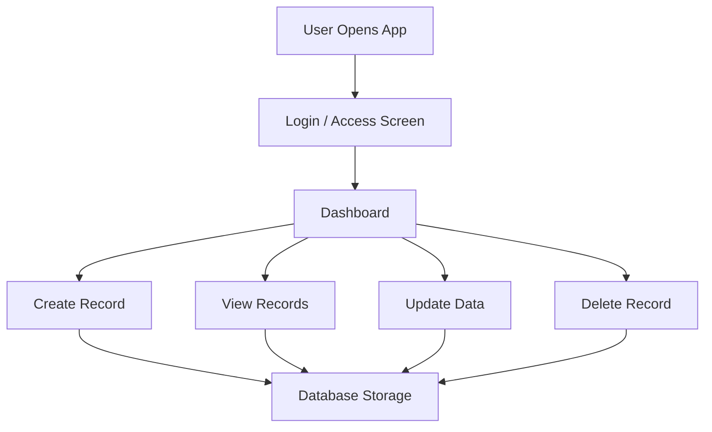

# 📱 Android-CRUD-App

<div align="center">


</div>

---

<div align="center">

# 🚀 Mobile Application Development Showcase


</div>

---

# 📊 GitHub Analytics


<div align="center">


</div>

---

# 📈 Contribution Graph

<div align="center">


</div>

---

# 📌 Project Overview

This Android CRUD application was developed to demonstrate practical **mobile application development skills** using **Java, Android Studio, Firebase, and SQLite**.

The application focuses on delivering a smooth mobile experience with efficient CRUD functionality, scalable architecture, and responsive UI components.

It reflects real-world Android development practices while emphasizing performance, maintainability, and modern mobile application standards.

---

# 🏗️ Key Features Implemented

## 🔹 Complete CRUD Functionality

- Create new records dynamically
- Update existing data efficiently
- Delete unnecessary records securely
- Retrieve and display records instantly

---

## 🔹 Modern Android UI/UX

- Clean mobile interface
- Smooth user navigation
- Responsive layouts for better usability
- Professional application design

---

## 🔹 Firebase / SQLite Integration

- Real-time database management
- Structured data storage
- Secure backend communication
- Efficient data synchronization

---

## 🔹 Form Validation & Security

- Input validation mechanisms
- Error handling implementation
- Improved application reliability
- Better user data protection

---

## 🔹 Optimized Mobile Performance

- Faster screen rendering
- Efficient resource management
- Improved application responsiveness
- Enhanced user experience

---

# 📱 Application Workflow

<div align="center">



</div>

---

# 🧠 Skills & Technologies Used

<div align="center">


<br><br>


</div>

---

# 📊 Project Development Analytics

<div align="center">

| Feature | Status |
|----------|--------|
| CRUD Operations | ✅ Completed |
| Firebase Integration | ✅ Completed |
| SQLite Database | ✅ Completed |
| Form Validation | ✅ Completed |
| Responsive UI | ✅ Completed |
| Error Handling | ✅ Completed |
| Performance Optimization | 🚧 In Progress |
| Cloud Deployment | 🔜 Planned |

</div>

---

# 📊 Skill Proficiency Overview

```text
Android Development     █████████████████  88%
Java Programming        ████████████████   86%
Firebase Integration    ██████████████     80%
SQLite Database         █████████████      78%
Mobile UI Design        ███████████████    84%
Problem Solving         ███████████████    85%
```

---

# 🚀 Learning Outcomes

This project significantly improved my understanding of:

- Android application architecture
- Java-based mobile development
- Firebase real-time database integration
- SQLite database handling
- Responsive mobile UI design
- Mobile application optimization
- User interaction and navigation flow
- Real-world Android development practices

---

# 🚀 Future Enhancements

- User Authentication System
- Dark Mode Integration
- Push Notifications
- REST API Integration
- Cloud Synchronization
- Advanced UI Animations
- Role-Based Access System
- App Deployment on Play Store

---

# 🏆 Project Highlights

<div align="center">

✨ Real-Time CRUD Operations  
✨ Firebase Database Connectivity  
✨ Mobile Responsive Design  
✨ Scalable Android Architecture  
✨ User-Friendly Interface  
✨ Optimized Performance  

</div>

---

# 📌 Why This Project Matters

This project demonstrates my ability to design and develop scalable Android applications using modern technologies and structured development methodologies.

It highlights my expertise in:

- Mobile App Development
- Backend Integration
- Database Management
- Android UI/UX
- Software Engineering Principles

---

# 🙏 Acknowledgement

Special thanks to my mentors, instructors, and learning resources that contributed to strengthening my Android development journey and practical implementation skills.

---

# ⭐ Conclusion

This project reflects my continuous growth in **Android Application Development, Mobile UI Design, and Backend Integration** while enhancing my practical software engineering capabilities.

---

<div align="center">

## 🌟 If you found this project useful, consider giving it a star ⭐

</div>
